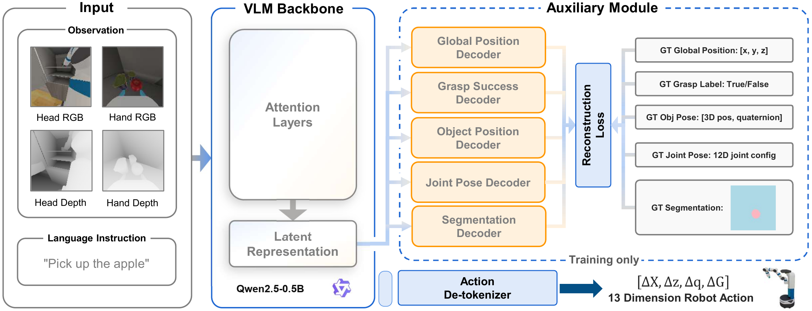
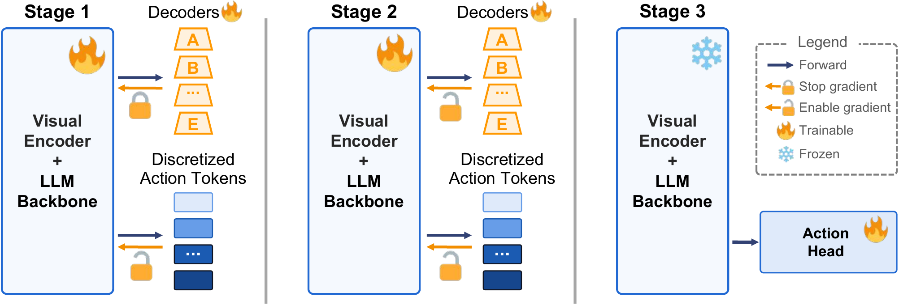

# SG-VLA: Learning Spatially-Grounded Vision-Language-Action Models for Mobile Manipulation

[Project Page](https://trs07170.github.io/SG-VLA/) | [Paper](https://arxiv.org/abs/2603.22760) | Code coming soon

**[Ruisen Tu](https://trs07170.github.io/)**, [Arth Shukla](https://arth.website/), [Sohyun Yoo](https://www.linkedin.com/in/sohyun-yoo/), [Xuanlin Li](https://xuanlinli17.github.io/), Junxi Li, Jianwen Xie, Hao Su, and [Zhuowen Tu](https://pages.ucsd.edu/~ztu/)

## Overview

SG-VLA is a spatially grounded vision-language-action model for long-horizon household mobile manipulation. Unlike tabletop manipulation, mobile manipulation requires a robot to jointly reason about scene layout, object geometry, its own configuration, and coordinated motion across the base, torso, arm, and gripper.

SG-VLA enriches both the model inputs and its training objectives. It combines head- and hand-camera RGB observations with depth, then co-trains auxiliary decoders that reconstruct spatial and manipulation-relevant properties from the shared visual-language representation. A progressive training strategy prevents noisy gradients from randomly initialized decoders from disrupting the pretrained backbone before jointly refining the full model.

The resulting 1.3B-parameter model improves average success from **60% to 73%** across ManiSkill-HAB household manipulation tasks.

## Highlights

- **Spatially rich perception:** complementary head- and hand-camera RGB views provide global and local context, while paired depth maps expose scene geometry explicitly.
- **Spatial auxiliary supervision:** auxiliary objectives reconstruct global robot position, grasp state, joint configuration, target-object pose, and target-object segmentation.
- **Progressive co-training:** a staged optimization procedure first adapts the auxiliary decoders and then enables full joint refinement.
- **Flexible action generation:** SG-VLA supports discrete action-token prediction and an optional flow-matching action head for continuous control.
- **Compact backbone:** the model is built on Qwen2.5-0.5B and contains approximately 1.3B parameters in total.

## Architecture



SG-VLA processes language instructions together with multi-view RGB-depth observations. The shared VLM representation supports both robot-action prediction and five auxiliary reconstruction objectives:

1. Global robot position `[x, y, z]`
2. Grasp state
3. 12-dimensional joint configuration
4. 7-dimensional target-object pose
5. Target-object segmentation

Each 13-dimensional robot action specifies delta joint positions for seven arm joints, head pan and tilt, and torso lift, plus a gripper open/close scalar and mobile-base forward and yaw/angular velocities. The strongest input configuration uses multi-view RGB and depth without action history; the study also evaluates temporal context from the four previous actions.

## Progressive Training



Training is divided into three stages:

1. **Decoder adaptation:** auxiliary gradients are prevented from entering the VLM backbone while the randomly initialized decoders learn to interpret its existing features. The discrete action-token path continues to update the backbone.
2. **Joint refinement:** full auxiliary gradient flow is enabled so action prediction and spatial reconstruction objectives jointly refine the shared representation.
3. **Action-head training:** the VLM is frozen and the optional flow-matching action head is trained independently to generate continuous action chunks.

## Data and Evaluation

SG-VLA is evaluated on long-horizon household rearrangement tasks from ManiSkill-HAB:

- **TidyHouse**
- **PrepareGroceries**
- **SetTable**

The evaluation covers six manipulation settings across four primitives: picking, placing, opening a refrigerator or drawer, and closing a refrigerator or drawer. The project uses approximately **44K episodes** and **1.4M transitions** across its training subsets and auxiliary annotations.

## Main Results

| Comparison | Average success |
| --- | ---: |
| OpenVLA | 0.04 |
| OpenVLA + multi-view RGB + depth | 0.32 |
| Base VLM + multi-view RGB + depth | 0.60 |
| Naive auxiliary co-training | 0.51 |
| **SG-VLA with progressive training** | **0.73** |

Additional findings include:

- Target-object segmentation and pose reconstruction improve cross-task Pick and Place success from **0.27 to 0.47**.
- The optional flow-matching action head improves Pick and Place performance but reduces the overall average from **0.73 to 0.69**, indicating a task-dependent tradeoff.
- Multi-view RGB-depth perception substantially improves performance over single-view RGB inputs.

Full per-task results, ablations, and simulation rollouts are available on the [project page](https://trs07170.github.io/sg-vla-page/).

## Release Status

- [x] Paper
- [x] Project page and simulation rollouts
- [ ] Training and evaluation code
- [ ] Model checkpoints

## Citation

If you find SG-VLA useful, please cite:

```bibtex
@misc{tu2026sgvlalearningspatiallygroundedvisionlanguageaction,
      title={SG-VLA: Learning Spatially-Grounded Vision-Language-Action Models for Mobile Manipulation},
      author={Ruisen Tu and Arth Shukla and Sohyun Yoo and Xuanlin Li and Junxi Li and Jianwen Xie and Hao Su and Zhuowen Tu},
      year={2026},
      eprint={2603.22760},
      archivePrefix={arXiv},
      primaryClass={cs.RO},
      url={https://arxiv.org/abs/2603.22760}
}
```
